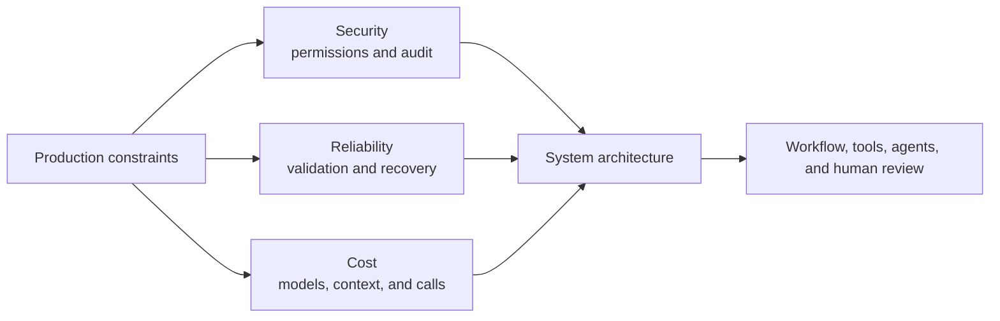
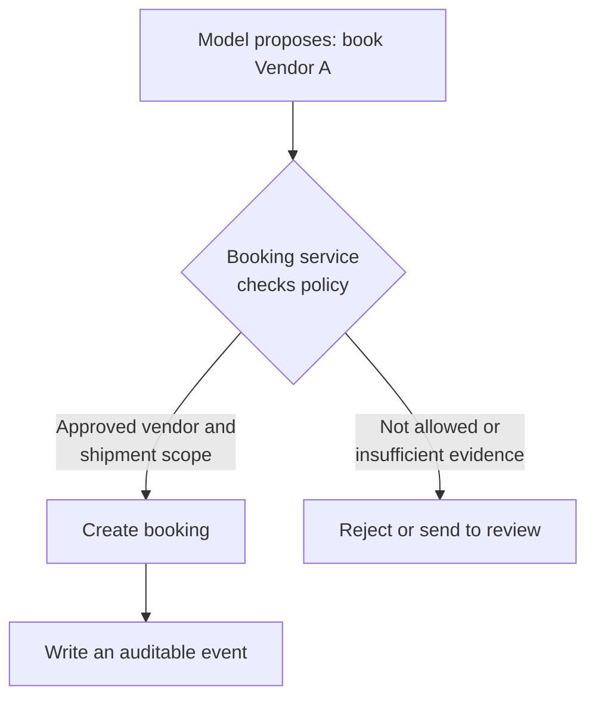
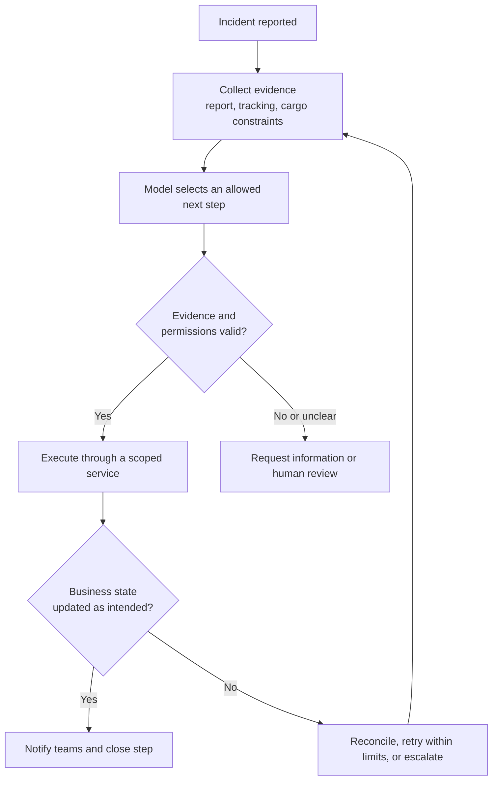
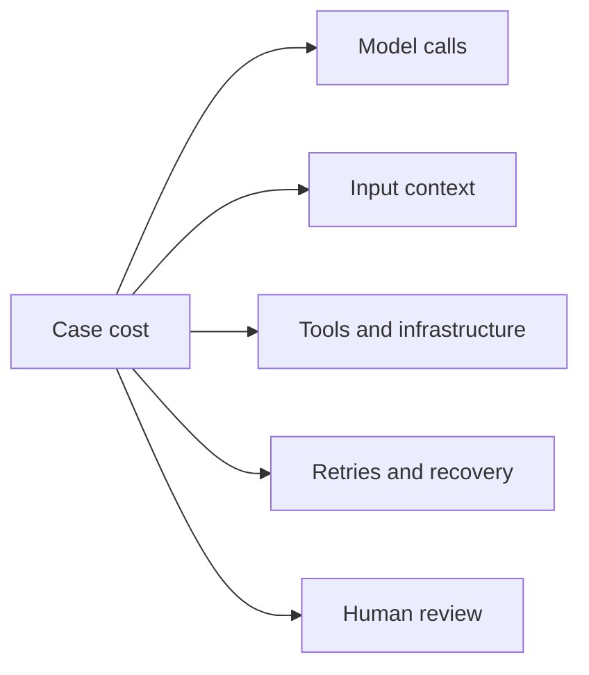
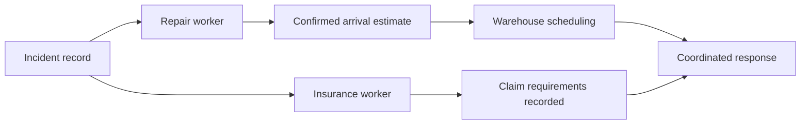
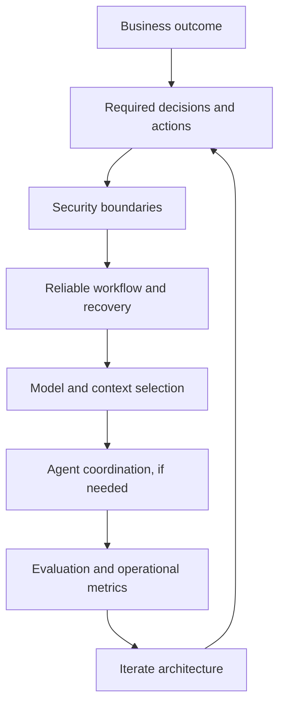

# Designing AI Agents for Operations

Most agent architecture conversations start with a model: should the system use one agent, a supervisor, or a swarm of specialists?

That is the wrong first question for an operational system. Start with the constraints that will determine whether the system can run in production:

1. **Security:** What data and actions may the system use?
2. **Reliability:** What must happen correctly, including when a dependency fails?
3. **Cost:** What can the business afford for each completed case?

Those constraints shape the architecture. They determine where an LLM can make a decision, where ordinary software must enforce a rule, how much context to provide, and whether an additional agent creates useful separation or unnecessary coordination work.



This article uses a delayed-shipment response as a running example. The same reasoning applies to finance, customer operations, support, and internal data systems.

## The architectural starting point

An **agent** uses a model to select actions toward a goal, observes the results, and adapts its next step. A **workflow** uses application code to control a known sequence of work. Workflows can include model calls and agents.

The distinction matters because an LLM is good at interpreting ambiguous input, while the application is responsible for authority, state, and execution. A model may suggest “book an approved repair vendor”; the booking service decides whether that request is permitted and carries it out safely.

| Production question | Architecture consequence | Example |
| --- | --- | --- |
| Who may perform this action? | Enforce permission checks at the tool or service boundary. | Only a repair capability can create an approved vendor booking. |
| What happens if a request is repeated or times out? | Record state, make writes idempotent, and define recovery steps. | A retry cannot book the same repair twice. |
| How much judgment is needed? | Use a model for ambiguity; use rules for defined conditions. | Interpret a driver photo; enforce “approval exists before payment.” |
| What does a completed case cost? | Measure all calls, context, retries, tools, and human intervention. | Cost per successfully resolved shipment, not cost per prompt. |

## 1. Security defines the boundary of every capability

Security is not a prompt instruction. It is an application property.

Consider a system responding to a delayed shipment. It may need to read tracking data, find an approved repair vendor, update an arrival estimate, and notify a warehouse. It does not need the ability to alter a vendor's bank account or release payment.

The system should give each capability the smallest useful access boundary. This is **least privilege**: a component can read or change only what its responsibility requires.

| Responsibility | Data or action it needs | Boundary to enforce |
| --- | --- | --- |
| Understand the incident | Driver report, images, shipment details | Read-only access to the assigned shipment |
| Arrange repair | Approved vendor directory, booking API | Create bookings only for approved vendors |
| Reschedule delivery | Arrival estimate, receiving slots | Update the affected delivery only |
| Prepare an insurance claim | Incident record, relevant policy | Create a claim package; no payment authority |



The enforcement point is the service that executes the action. An instruction such as “use approved vendors only” improves the model's behavior, but it cannot be the final control.

Microsoft's guidance for Entra Agent ID treats identity, ownership, scoped permissions, and auditing as requirements before autonomy expands. OpenAI describes an internal data agent that inherits existing user permissions, so a user can query only datasets they already have access to. [1][2]

### Design implication: split authority before splitting agents

Several agents do not make a system safer if all of them share the same unrestricted tools. Separate agents help only when the underlying capabilities, identities, and audit trails are also separate.

For a payment workflow, the model can extract fields from an invoice or explain a mismatch. The payment service still requires a matching purchase order, completed compliance checks, and recorded approval. Those conditions belong in deterministic application code.

## 2. Reliability means checking both decisions and execution

Reliable operations have two separate failure modes:

1. The system chooses the wrong next action.
2. It chooses the right action but executes it incorrectly.

A model might identify the right repair vendor, while a retry after a timeout creates two bookings. Or the booking might succeed perfectly for a vendor the system should never have chosen. A production design has to handle both.

| Layer | What can fail | Control |
| --- | --- | --- |
| Decision | Misread document, missing constraint, wrong classification | Bounded choices, evidence checks, evaluation cases, escalation |
| Execution | Timeout, duplicate write, unavailable dependency | Idempotency keys, durable state, retries with limits, reconciliation |
| Outcome | Work completed technically but failed the business goal | Verify the resulting state and track completed cases |

An **idempotency key** is a unique identifier for a write operation. When a request is repeated, the service recognizes that it already processed the intended action instead of performing it twice.

### A reliable delayed-shipment loop

The operational workflow owns the state and the allowed transitions. The model works inside that boundary.



This is where a workflow often outperforms an open-ended agent: it makes the order of mandatory steps visible and enforceable. The model can still interpret a driver's description, choose among allowed responses, or explain a mismatch.

OpenAI reports evaluating its internal data agent against both generated SQL and the resulting data. Anthropic describes checkpoints, retry logic, and production tracing in its research system. [2][3] A schema-valid response is useful, but it proves only that the answer has the expected shape; it does not prove the business action was correct.

## 3. Cost is an architectural constraint, not a model-pricing exercise

The cost of an agentic system is driven by more than the model's listed token rate. It includes input context, generated output, tool calls, coordinator calls, retries, infrastructure, and the human work needed to recover failed cases.



The useful measure is:

```text
Cost per completed case =
  total model, tool, infrastructure, and recovery cost
  / successfully completed cases
```

### Match the model to the responsibility

Use model capability where it adds value. Checking a recorded approval is ordinary software. Interpreting an unusual driver image may need vision. Choosing from a small set of policy-approved next steps may need a low-cost structured-decision model. Investigating a novel incident may need stronger reasoning and tool use.

| Responsibility | Suitable approach | Why |
| --- | --- | --- |
| Verify payment approval | Application rule | The condition is explicit and must be enforced. |
| Extract fields from a scanned invoice | Model with document understanding | The input is unstructured. |
| Choose an approved next step | Structured model output | The response belongs to a defined set. |
| Investigate an unfamiliar incident | Stronger agent with controlled tools | The path may require adaptive research. |
| Send a confirmed status update | Template or text model | The facts have already been decided. |

TypeSafe AI positions Jev as a typed-decision model with published input pricing of $0.042 per million tokens. Anthropic's multi-agent research system reports strong evaluation gains in one setting, but also about 15 times the token use of ordinary chat. [3][4] The lesson is not to standardize on either pattern. Price and evaluate each responsibility separately.

## 4. Choose the shape of the system from dependencies

Once the constraints are clear, choose how work is coordinated. The key question is whether parts of the work can proceed independently without losing information they need to make a correct decision.

| Work structure | Best starting point | Reason |
| --- | --- | --- |
| Known steps with a mandatory order | Workflow with selected model calls | Code makes order, permissions, and recovery explicit. |
| Ambiguous work with tightly shared state | One agent with controlled tools | One owner can preserve the reasoning across dependent changes. |
| Independent investigations | Multiple workers or agents | Each worker can use focused evidence and return a defined result. |
| A mix of independent and dependent work | Workflow coordinating bounded agents | The workflow resolves dependencies and records state. |

### Why coding and operations often need different coordination

An agent changing API authentication may need to understand middleware, database fields, handlers, tests, and existing clients as one connected system. Each edit changes the shared state. One agent owning the implementation is often the clearest starting point, with separate reviewers for independent checks.

In a shipment incident, some tasks have narrower boundaries. A repair worker needs vehicle details and approved vendor availability. An insurance worker needs the incident report and policy. Warehouse scheduling needs a confirmed arrival estimate, so it must wait for the repair result.



Google Research evaluated 180 agent configurations. Centralized multi-agent coordination improved one Finance-Agent benchmark by 80.9% relative to its single-agent baseline, while multi-agent variants reduced performance by 39–70% on sequential PlanCraft tasks. [5] These results are specific to those evaluations, but they give a practical rule: add workers when work can be genuinely separated; keep a single owner when coordination itself is the hard problem.

## 5. Treat context as a decision contract

The context window includes the instructions, selected history, documents, and tool results the model sees in a request. The application's job is not to forward the entire database. It is to provide the smallest set of current facts that support the decision.

For a repair decision, that might be the vehicle problem, location, cargo constraints, and approved vendors. For warehouse scheduling, it might be the confirmed arrival time and available slots. A refrigeration requirement is irrelevant to an initial invoice extraction but essential to a replacement-vehicle decision.

| Decision | Include | Exclude unless it changes the decision |
| --- | --- | --- |
| Arrange repair | Current fault, location, cargo constraints, approved vendors | Old completed incidents |
| Schedule receiving | Confirmed ETA, warehouse slots, receiving constraints | Vendor research notes |
| Prepare claim | Incident evidence, coverage terms, required fields | Warehouse conversations |

Focused context helps reliability because evidence and constraints are easier to find. It helps cost because fewer input tokens are processed. It can also fail when a necessary dependency is omitted, so context selection needs its own test cases.

The *Lost in the Middle* study found that retrieval and question-answering performance often declined when relevant information appeared in the middle of long inputs. Anthropic recommends summaries, saved notes, and focused sub-agent contexts for long tasks, while warning that summaries can lose important details. [6][7]

### Cache the stable prefix; keep live facts separate

Prompt caching can reduce repeated input-processing cost when an eligible, unchanged beginning of a request is reused. Put stable instructions and reference material first; add changing incident details afterward. Cache behavior, minimum lengths, retention, and pricing depend on the provider. [8]

With an illustrative input rate of $2 per million tokens, reducing a request from 100,000 tokens to 5,000 changes the input cost from $0.20 to $0.01. That is a 95% reduction per request, before output tokens and other costs. Ten focused workers can still consume 50,000 input tokens, so measure the whole workflow rather than celebrating a single small prompt.

## 6. Build the system in this order

Architecture becomes easier when the implementation follows the constraints instead of the novelty of the agent framework.

1. **Map decisions and actions.** Separate interpretation, policy decisions, and external writes.
2. **Define authority.** Give every tool and service a scoped identity, allowed inputs, and audit trail.
3. **Make the happy path and recovery path explicit.** Record state, use idempotent writes, limit retries, and define the human handoff.
4. **Choose the smallest coordination model that fits.** Start with a workflow or single agent unless independent work clearly benefits from delegation.
5. **Design context per decision.** Include current evidence and constraints; test for missing dependencies.
6. **Evaluate the production outcome.** Measure decision quality, completed cases, latency, recovery rate, and cost per completed case.



For a delayed-shipment system, this may produce a stateful workflow that uses a model for bounded decisions, delegates adaptive vendor search to an agent, and sends notifications through ordinary code. For a tightly connected code change, it may produce one agent with controlled repository tools and separate review tasks.

The architecture should follow the responsibilities, dependencies, and constraints of the work. Security, reliability, and cost are not implementation details added after the agent is built. They are the first principles that decide what the agentic system should be.

## Sources

1. Microsoft, [Least privilege for AI agents with Microsoft Entra Agent ID](https://learn.microsoft.com/en-us/security/zero-trust/sfi/least-privilege-for-ai-agents).
2. OpenAI, [Inside our in-house data agent](https://openai.com/index/inside-our-in-house-data-agent/), January 2026.
3. Anthropic, [How we built our multi-agent research system](https://www.anthropic.com/engineering/multi-agent-research-system), June 2025.
4. TypeSafe AI, [Introducing System One Models & Jev](https://typesafe.ai/blog/introducing-system-one-models-and-jev), September 2026, and [published pricing](https://typesafe.ai/).
5. Google Research, [Towards a science of scaling agent systems](https://research.google/blog/towards-a-science-of-scaling-agent-systems-when-and-why-agent-systems-work/), January 2026.
6. Liu et al., [Lost in the Middle: How Language Models Use Long Contexts](https://arxiv.org/abs/2307.03172), 2023.
7. Anthropic, [Effective context engineering for AI agents](https://www.anthropic.com/engineering/effective-context-engineering-for-ai-agents), September 2025.
8. OpenAI, [Prompt caching documentation](https://developers.openai.com/api/docs/guides/prompt-caching).

*Company descriptions and pricing were checked on 3 October 2026. Diagrams and calculations are illustrative; research figures apply to the cited evaluations.*
