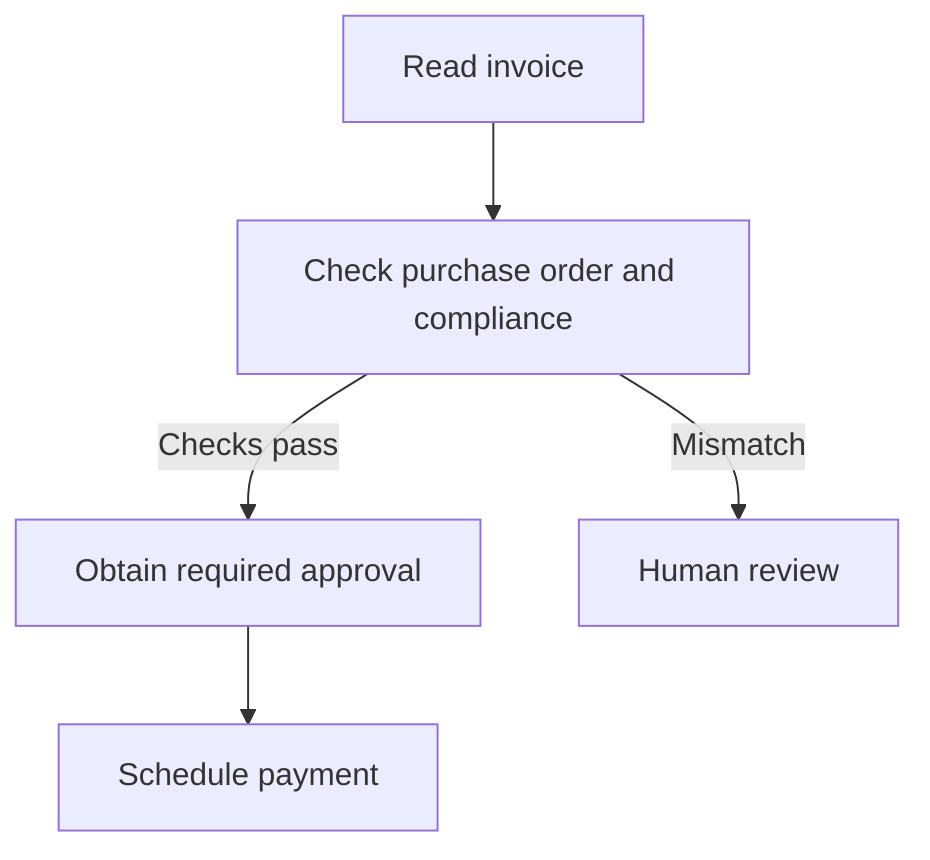
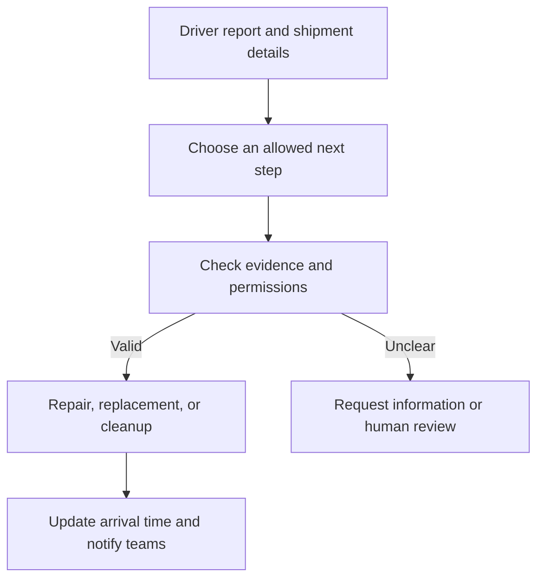
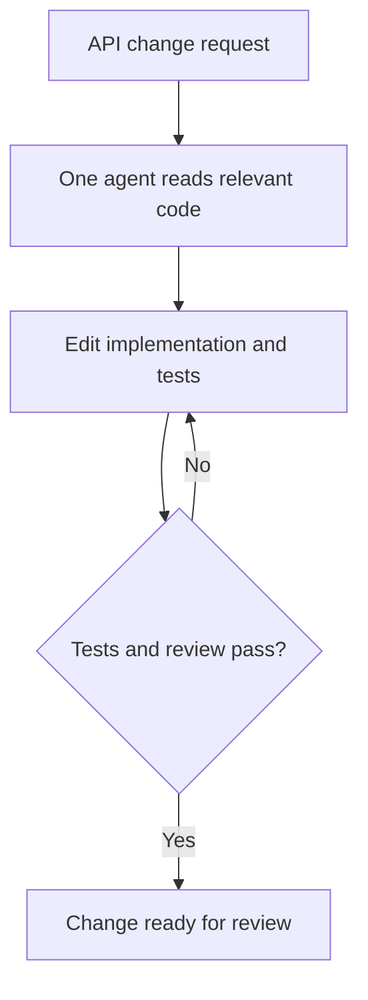
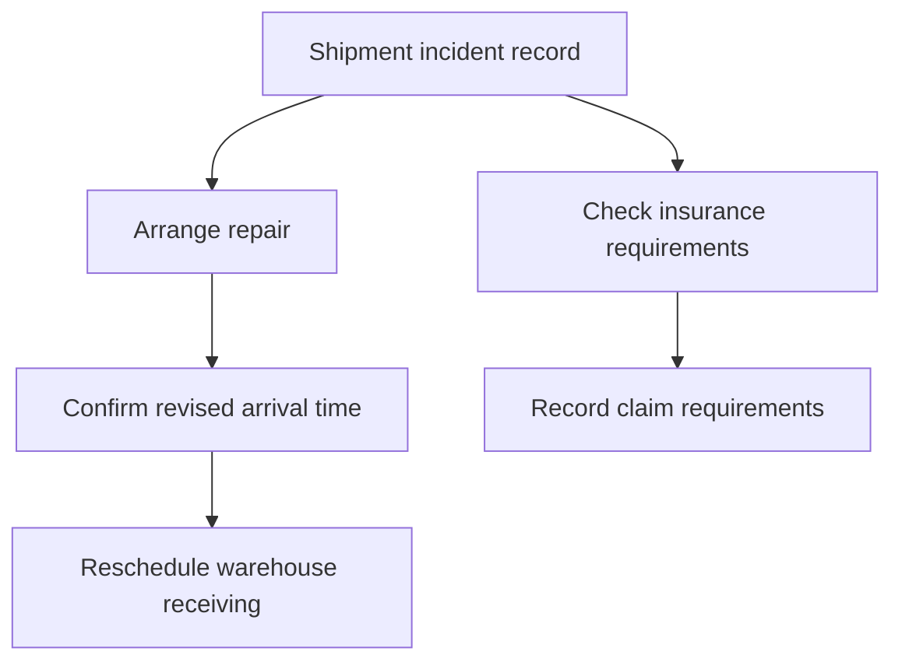

# Designing AI Agents for Operations

## What enterprises need from AI agents

For enterprise use, an AI system needs to meet three requirements:

- **Security:** it accesses only the data and actions it is allowed to use.
- **Reliability:** it completes the intended task correctly and handles failures.
- **Cost:** its model usage and operating cost make sense for the business outcome.

Model providers have made substantial progress in reasoning, coding, and structured decisions. General models and specialized models such as Jev give developers different capabilities to work with. The implementation still needs to connect those capabilities to business rules, permissions, and real operational data.

A useful starting point is therefore to design the architecture around these three requirements. The choice between one agent and several agents follows from that design.

> **Prerequisite: What is an agent?**  
> A model receives information and produces an output. A tool is a function that retrieves information or performs an action. An agent uses a model to choose actions toward a goal, observe the results, and adjust what it does next. A workflow uses application code to control the sequence of steps. A workflow can contain model calls and agents.

## 1. Security: control what the system can access

> **Prerequisite: Permissions and least privilege**  
> A permission defines what a component can read or change. Least privilege means giving it only the permissions required for its task.

Consider an agent handling a delayed shipment. It might need to read tracking information, contact repair vendors, and notify the receiving warehouse.

It does not automatically need permission to change a vendor's bank account or release a payment.

Giving every tool to one agent increases the possible impact of a mistake. Separating responsibilities can help, provided the application also separates access.

| Responsibility | Access needed |
| --- | --- |
| Understand the incident | Driver report, images, and shipment details |
| Arrange a repair | Approved vendor directory and repair booking |
| Reschedule delivery | Arrival estimate and warehouse receiving slots |
| Handle an insurance claim | Incident records and relevant policy documents |

The model can request an action. The application should check whether that action is allowed before executing it.

This remains necessary even when the prompt contains clear instructions. An instruction saying “use approved vendors only” should be backed by a booking service that rejects unapproved vendors.

### What companies are doing

**Microsoft** documents agent identity, ownership, scoped permissions, and auditing through Microsoft Entra Agent ID. Its guidance treats least privilege as a design requirement before expanding agent autonomy. [1]

**OpenAI** describes an internal data agent that inherits existing user permissions. Users can query only datasets they already have access to. [2]

The architectural lesson is to give each component an explicit access boundary. Multiple agents can support this separation, but the permissions must be enforced by the application.

## 2. Reliability: make the required behavior explicit

> **Prerequisite: Model decisions and fixed rules**  
> A model interprets information and can make an incorrect decision. A fixed application rule specifies what happens under defined conditions. For example, “payment requires a recorded approval” is a rule the application can enforce.

Reliability has two parts:

1. Choosing the appropriate action.
2. Executing it correctly.

An agent might choose the right repair vendor but book the same service twice after a timeout. It might also execute a booking perfectly after choosing the wrong vendor. Both are failures.

We therefore need checks around the model's decision and around the action itself.

### Example: carrier invoice payment

The invoice may be a PDF that needs interpretation. The payment prerequisites are explicit: match the purchase order, complete the required compliance checks, and obtain approval.



The workflow controls the order. The payment service verifies that the required checks and approval exist.

An LLM can extract invoice fields or explain a mismatch. The application controls whether payment is permitted.

To handle retries, the service can use an **idempotency key**: a unique identifier that lets it recognize repeated requests for the same payment. If a request times out, the application checks the payment status before trying again.

This design can be implemented as a workflow with model calls. It does not require a separate agent for every step.

### Example: delayed shipment

A delayed shipment has more uncertainty. A driver might describe a mechanical problem, send an image of spilled cargo, or provide incomplete information.

> **Prerequisite: Bounded decisions and evidence**  
> A bounded decision selects from a defined set of allowed options. Evidence is the information supporting that decision, such as a driver report, a recent tracking update, or confirmed vendor availability.



The model interprets the incident. The application validates the proposed action and executes the appropriate capability. Safety-related responses follow established operating procedures.

If a vendor declines the booking, the system records that result and makes another decision. It also needs limits on attempts and a clear point for human intervention.

### What companies are doing

**OpenAI's internal data agent** uses evaluations that inspect both generated SQL and its results. OpenAI also reports improving reliability by reducing overlapping tools that confused the agent. [2]

**Anthropic's research system** combines model adaptation with checkpoints and retry logic. Its engineering account also describes production tracing to investigate why agents failed. [3]

The architectural lesson is to test the decision, record the execution, and verify the business result. A valid response format is only one part of correctness.

## 3. Cost: choose models for specific responsibilities

> **Prerequisite: Input tokens and output tokens**  
> Tokens are units of content processed by a model. Input tokens include instructions, documents, history, and tool results supplied to it. Output tokens are what it generates. Many APIs charge separately for input and output, and different models have different rates.

A strong general model may be useful for understanding an unusual incident or writing a detailed explanation. A smaller model or a specialized decision model may be sufficient to choose between a few well-defined next steps.

The choice should follow the task's requirements:

| Task | Model capability to evaluate |
| --- | --- |
| Interpret a driver image | Image understanding |
| Select an allowed next step | Accurate structured decisions |
| Investigate an unusual incident | Reasoning and tool use |
| Draft a stakeholder update | Clear text generation |
| Check recorded payment approval | Ordinary application code |

A process can use different models for different responsibilities. This lets you evaluate quality and cost at each step.

### What companies are doing

**TypeSafe AI** offers Jev for typed decisions: choices, scores, and probability estimates that software can consume. Its published pricing is **$0.042 per million input tokens**, with no output-token charge. [4]

**Anthropic** uses a lead agent and specialized workers in its research system. Its internal evaluation reported a **90.2% performance improvement** over its single-agent baseline, alongside substantial token usage: approximately **15 times ordinary chat usage** for multi-agent systems. [3]

These examples represent different uses of models. A decision model can support a narrow branch in a workflow. A research system may justify several agents because it needs independent investigation.

Type-safe output means the response fits the allowed structure. The selected answer still needs evaluation for correctness.

## 4. Why coding and bounded workflows need different designs

> **Prerequisite: State and coupling**  
> State is the current condition of the work: files, records, decisions, and completed actions. Coupling describes how much one task depends on another. When a change in one part affects many others, the tasks are tightly coupled.

### Coding often needs a shared understanding

Suppose an agent changes API authentication. It may need to understand the middleware, database fields, handlers, tests, and existing clients together.

As it edits the code, that shared state changes. A decision in one file may affect the correct implementation in another.



One agent owning the change is a useful starting point. It can retrieve relevant files and keep track of the decisions connecting them.

With several agents, you must manage what each one knows, which code version it sees, and how conflicting edits are resolved. A handoff may lose important details. Sending the same large context to each worker may also increase token usage.

Coding can still benefit from parallel work. Independent security reviews, repository searches, or changes to separate components may be suitable for delegation.

### Bounded operational tasks can use smaller inputs

In a shipment incident, some responsibilities have clearer boundaries.

The repair task needs vehicle details and vendor availability. The insurance task needs the incident report and policy. The warehouse task needs the revised arrival time and receiving constraints.



The insurance check may proceed independently. Warehouse scheduling depends on the arrival estimate, so it waits for that result.

This allows each component to receive a focused input and return a defined result. A worker needs a separate agent when it must adapt its own actions toward a delegated goal. A fixed extraction or classification step can remain a model call inside a workflow.

### What the research suggests

Google Research evaluated **180 agent configurations**. Centralized multi-agent coordination improved performance by **80.9% relative to a single-agent baseline on Finance-Agent**. On sequential PlanCraft tasks, multi-agent variants reduced performance by **39–70%**. [5]

These are results for particular evaluations, not expected gains for every operational workflow. They support a useful design question: can the work be divided without losing the information needed to coordinate it?

| Task structure | Starting design |
| --- | --- |
| Known steps with mandatory order | Workflow with selected model calls |
| Dynamic work with tightly shared state | One agent with controlled tools |
| Independent investigations | Multiple workers or agents |
| Mixed dependencies | Workflow coordinating bounded agents |

## 5. Managing context improves reliability and cost

> **Prerequisite: The context window**  
> The context window is the amount of information a model can work with in one request. It includes instructions, selected history, documents, and tool results. Depending on the model, output also uses part of that capacity. The application manages what information is included.

A database can hold the complete incident history. A model request should contain the information needed for its current decision.

For a repair decision, that might be the vehicle problem, location, cargo constraints, and available vendors. For warehouse scheduling, it might be the confirmed arrival time and receiving slots.

### How this helps reliability

Relevant context makes the evidence and constraints easier to identify. Unrelated documents can add conflicting information or distract from the current task.

However, reducing context too far can remove a necessary fact. For example, a replacement vehicle decision needs to know whether the cargo requires refrigeration.

The goal is to provide the smallest useful set of information, including the dependencies that affect the decision.

The 2023 *Lost in the Middle* study found that retrieval and question-answering performance often declined when relevant information appeared in the middle of long inputs. [6] This is a reason to test context selection; it is not a guarantee that shorter inputs always perform better.

**Anthropic** describes using conversation summaries, saved notes, and focused sub-agent contexts for long tasks. It also warns that summaries can lose important details. [7]

### How this helps cost

With an input rate of $2 per million tokens:

| Input per request | Input cost |
| --- | ---: |
| 100,000 tokens | $0.200 |
| 5,000 tokens | $0.010 |

This illustrative reduction saves **95% of input cost per request**. Output and other charges are separate.

The total depends on how many calls the design makes. Ten workers using 5,000 tokens each process 50,000 input tokens in total, before coordinator calls and retries.

Measure total workflow usage rather than only the size of an individual prompt.

### Reusing context with prompt caching

> **Prerequisite: Prompt caching**  
> A provider can reuse computation for an eligible unchanged beginning of a request, called a prefix. This is prompt caching. The model still processes new material and generates a new response. Cache rules and prices differ by model.

Stable instructions and shared reference material can go first, followed by changing incident details.

Adding a new event can preserve reuse of an earlier prefix. Editing content near the beginning can prevent reuse after that change. Actual reuse depends on the provider's cache boundaries, minimum length, and retention rules. [8]

Caching lowers repeated input-processing cost. It does not remove those tokens from the context window or make the decision more accurate.

## 6. Combine focused context with the right model

Model selection and context selection should be evaluated together.

A weaker model may perform adequately when given clear evidence and a narrow decision. A stronger model may still fail when given outdated information or missing constraints.

For each task:

1. Define the required output and acceptable error rate.
2. Build examples of ordinary, ambiguous, and failure cases.
3. Compare candidate models using the same relevant inputs.
4. Measure correctness, latency, and total cost.
5. Route difficult cases to a stronger model or human review where that improves results.

### Pricing example

The following published rates were checked on **3 October 2026**. The models have different capabilities, so this is a billing comparison rather than a performance comparison. [4][9]

| Model | Input per million tokens | Cached input | Output per million tokens |
| --- | ---: | ---: | ---: |
| GPT-4.1 | $2.00 | $0.50 | $8.00 |
| Jev | $0.042 | Not used in this example | No output charge |

For a 5,000-token request with 500 generated output tokens, GPT-4.1's uncached token cost is:

```text
Input:  5,000 / 1,000,000 × $2 = $0.010
Output:   500 / 1,000,000 × $8 = $0.004
Total:                          $0.014
```

A 5,000-token Jev decision request costs **$0.00021** at the published input rate. Jev returns typed decisions rather than the 500-token explanation in the first example.

For caching, consider GPT-4.1 requests containing a reusable 100,000-token document, 1,000 new input tokens, and 1,000 output tokens:

| Scenario | Total token cost |
| --- | ---: |
| One request without caching | $0.210 |
| One request with the document fully cached | $0.060 |
| Ten requests without caching | $2.100 |
| One uncached request, then nine cached requests | $0.750 |

The final row assumes eligible cache reuse for every later request. Under those assumptions, total token cost falls by **64.3%**.

These calculations exclude tool calls, infrastructure, retries, and human review. The useful business measure is:

```text
Cost per completed case =
    total model, tool, infrastructure, and recovery cost
    / successfully completed cases
```

## 7. Turn the requirements into architecture

| Requirement | Design choice | What to measure |
| --- | --- | --- |
| Security | Scoped identities, tools, and permissions | Unauthorized access or action attempts |
| Reliability | Validated decisions, enforced prerequisites, and recoverable execution | Correct decisions and completed cases |
| Cost | Focused context, suitable models, and measured cache reuse | Total cost per completed case |

For a delayed-shipment system, this may lead to a workflow that stores incident state, uses a model for bounded decisions, delegates adaptive vendor search to an agent, and runs notifications through ordinary code.

For a tightly connected code change, it may lead to one agent owning the implementation, with separate reviewers where useful.

The architecture follows the responsibilities, dependencies, and requirements of the process.

## Sources

1. Microsoft, [Least privilege for AI agents with Microsoft Entra Agent ID](https://learn.microsoft.com/en-us/security/zero-trust/sfi/least-privilege-for-ai-agents).
2. OpenAI, [Inside our in-house data agent](https://openai.com/index/inside-our-in-house-data-agent/), January 2026.
3. Anthropic, [How we built our multi-agent research system](https://www.anthropic.com/engineering/multi-agent-research-system), June 2025.
4. TypeSafe AI, [Introducing System One Models & Jev](https://typesafe.ai/blog/introducing-system-one-models-and-jev), September 2026, and [published pricing](https://typesafe.ai/).
5. Google Research, [Towards a science of scaling agent systems](https://research.google/blog/towards-a-science-of-scaling-agent-systems-when-and-why-agent-systems-work/), January 2026.
6. Liu et al., [Lost in the Middle: How Language Models Use Long Contexts](https://arxiv.org/abs/2307.03172), 2023.
7. Anthropic, [Effective context engineering for AI agents](https://www.anthropic.com/engineering/effective-context-engineering-for-ai-agents), September 2025.
8. OpenAI, [Prompt caching documentation](https://developers.openai.com/api/docs/guides/prompt-caching).
9. OpenAI, [GPT-4.1 model documentation](https://developers.openai.com/api/docs/models/gpt-4.1).

*Company descriptions and prices were checked on 3 October 2026. Diagrams and calculations are illustrative. Research figures apply to the stated evaluations.*
